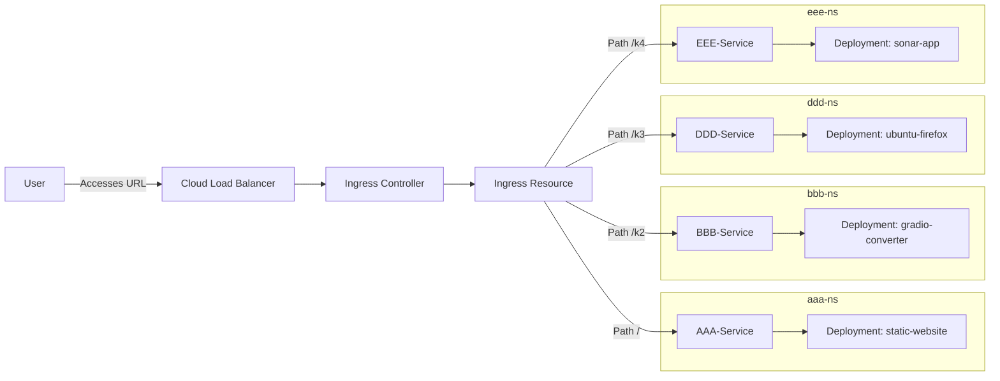

# Kubernetes Deployment Anleitung

## Voraussetzungen

- Kubernetes Cluster (Cloud Provider)
- Helm installiert
- ArgoCD installiert
- KUBECONFIG gesetzt

## Schritte zur Bereitstellung

### 1. Repository klonen

```bash
git clone https://github.com/Impulsleistung/k8s.git
cd k8s
```

### 2. Namespaces erstellen

```bash
kubectl create namespace aaa-ns
kubectl create namespace bbb-ns
kubectl create namespace ddd-ns
kubectl create namespace eee-ns
kubectl create namespace ingress-nginx
```

### 3. Ingress Controller installieren (falls noch nicht vorhanden)

```bash
helm repo add ingress-nginx https://kubernetes.github.io/ingress-nginx
helm repo update
helm install ingress-nginx ingress-nginx/ingress-nginx --namespace ingress-nginx
```

### 4. ArgoCD ApplicationSet deployen

```bash
kubectl apply -f argocd/applications.yaml
```

### 5. Zugriff testen

Warte, bis alle Pods laufen (`kubectl get pods -A`).

Öffne im Browser:

- `http://YOUR_DOMAIN/` (Static Homepage)
- `http://YOUR_DOMAIN/k2` (Markdown Converter)
- `http://YOUR_DOMAIN/k3` (Ubuntu Desktop mit Firefox)
- `http://YOUR_DOMAIN/k4` (Sonar App)

Ersetze `YOUR_DOMAIN` mit der Domain oder IP-Adresse deines Load Balancers.

## Architekturübersicht


